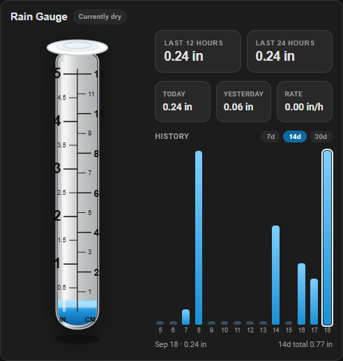
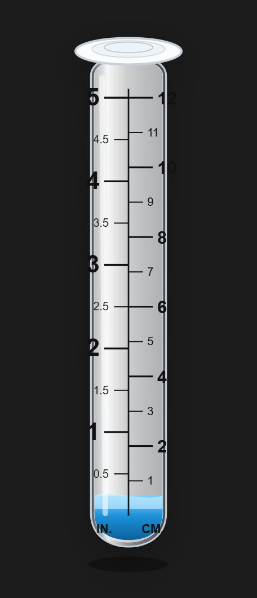
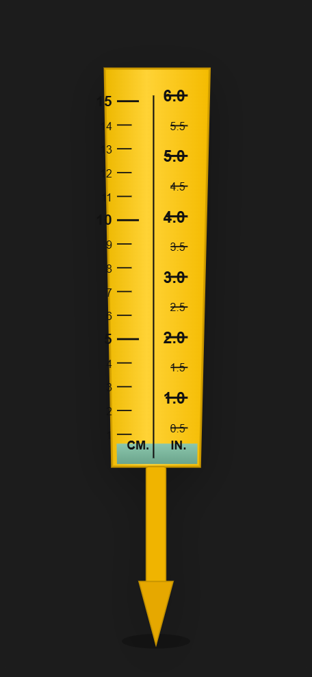
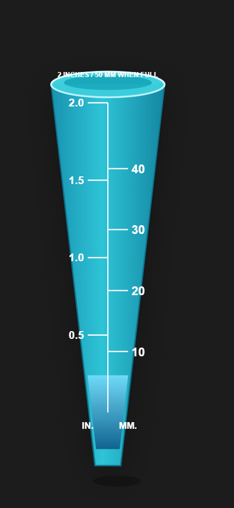
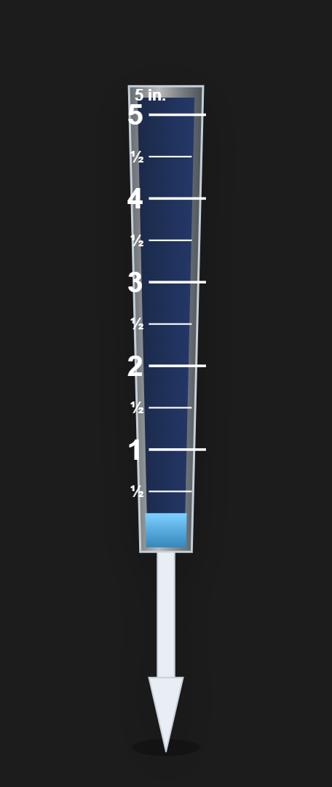
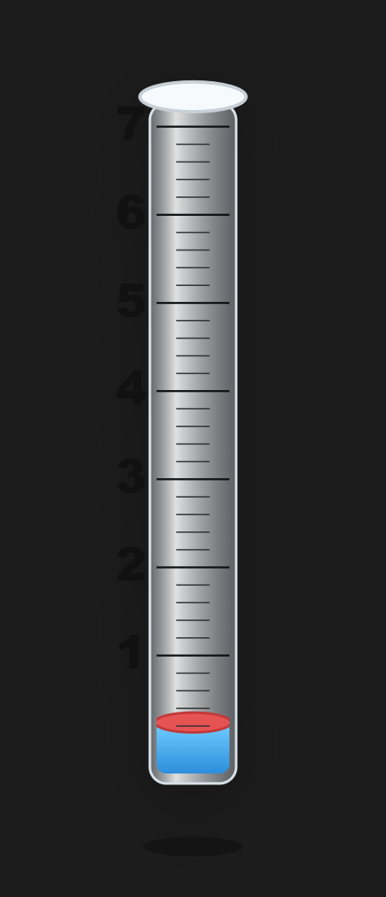
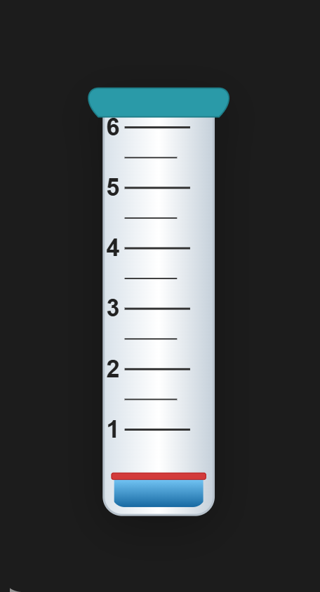
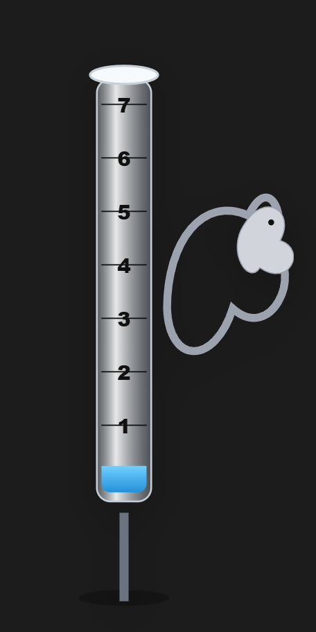

# Rain Gauge Plus Card

Lovelace card that looks like a real rain gauge, with **last 12 hours**, **last 24 hours**, today / yesterday, optional rain rate, and a daily history chart.

Works with a daily or accumulating precipitation sensor. History comes from the Home Assistant recorder (hourly / daily statistics).



## Gauge looks

Pick a style in the visual editor (**Gauge look**) or with `look:` in YAML. Product-style gauges keep their printed capacity; the classic tube can be scaled with `max_level`.

| Classic tube (5 in) | Yellow wedge (6 in) | Blue cone (2 in) |
| :---: | :---: | :---: |
|  |  |  |
| `tube` | `wedge` | `cone` |

| Clear taper (5 in) | Glass cylinder (7 in) | Fence cup (6 in) |
| :---: | :---: | :---: |
|  |  |  |
| `taper` | `glass7` | `fence` |

| Garden stake (7 in) |
| :---: |
|  |
| `garden` |

| `look` | Editor label | Native full scale | Notes |
| --- | --- | --- | --- |
| `tube` | Classic tube (5 in) | 5 in / 12 cm printed | Honors `max_level` |
| `wedge` | Yellow wedge (6 in) | 6 in | Stake-style wedge |
| `cone` | Blue cone (2 in) | 2 in / 50 mm | Small-storm cone |
| `taper` | Clear taper (5 in) | 5 in | Clear tapered tube |
| `glass7` | Glass cylinder (7 in) | 7 in | Float sits on the water |
| `fence` | Fence cup (6 in) | 6 in | Red line at the water surface |
| `garden` | Garden stake (7 in) | 7 in | Tube plus hanging iron |

## Install

1. Copy `rain-gauge-plus-card.js` to `config/www/` **or** add this repo in HACS → **Frontend** → **Custom repositories**
2. **Settings → Dashboards → Resources** → add `/local/rain-gauge-plus-card.js` (module)
3. Reload resources and hard-refresh the browser (**Ctrl+F5**)

### HACS custom repository

```
https://github.com/randrcomputers/ha-rain-gauge-card
```

Category: **Lovelace**

## Quick start

```yaml
type: custom:rain-gauge-plus-card
name: Rain Gauge
look: tube
entity: sensor.rain_total_today
hourly_rate_entity: sensor.outside_wind_and_rain_precipitation
max_level: 5
```

A daily **utility meter** (`total_increasing`) is ideal for the rain total. Any precipitation sensor works.

Set **Card size** to **50%** in the editor, or `size: 50` in YAML, to shrink the whole card.

## What you see

| Area | Source |
| --- | --- |
| Gauge fill | Rain total entity (today / live) |
| **Currently dry** / **Currently raining** | Rain rate, or rain in the current hour |
| Last 12 hours | Hourly recorder statistics |
| Last 24 hours | Hourly recorder statistics |
| Today | Current state of the rain total entity |
| Yesterday | `last_period` on a utility meter, when present |
| Rate | Optional rain-rate / precipitation entity |
| History | Daily recorder `change` for 7 / 14 / 30 days |

The 12h / 24h tiles are **totals**, not a rain-rate history. Rate is the optional live sensor only.

## Options

All of these are in the visual editor. YAML names match the editor labels below.

| YAML | Editor | Required | Default | Description |
| --- | --- | --- | --- | --- |
| `look` | Gauge look | no | `tube` | Gauge artwork — see **Gauge looks** |
| `size` | Card size | no | `100` | Overall card scale: `100`, `75`, or `50` |
| `entity` | Rain total (today / accumulating) | **yes** | — | Precipitation total (`sensor`, device class precipitation) |
| `hourly_rate_entity` | Rain rate (optional) | no | — | Rain rate or current-hour precipitation |
| `name` | Card title | no | `Rain Gauge` | Header text |
| `max_level` | Gauge max (classic tube only) | no | `5` | Full-scale reading for `look: tube` (inches unless metric) |
| `unit_system` | Display units | no | `auto` | `auto`, `imperial` (inches), or `metric` (millimeters) |
| `history_days` | Default history range | no | `14` | `7`, `14`, or `30` |
| `show_history` | Show daily history | no | `true` | Daily bar chart |
| `show_yesterday` | Show yesterday | no | `true` | Yesterday total tile |
| `show_rate` | Show rain rate | no | `true` | Rate tile |

### Example with every option

```yaml
type: custom:rain-gauge-plus-card
name: Rain Gauge
look: fence
size: 100
entity: sensor.rain_total_today
hourly_rate_entity: sensor.outside_wind_and_rain_precipitation
max_level: 5
unit_system: imperial
history_days: 14
show_history: true
show_yesterday: true
show_rate: true
```

`max_level` is ignored for wedge, cone, taper, glass, fence, and garden — those keep the printed scale from the product they follow.

## Requirements

- Home Assistant **2024.1+**
- Recorder enabled (for 12h / 24h and history)
- A precipitation sensor. A daily **utility meter** (`total_increasing`) is ideal.

## License

MIT — see [LICENSE](LICENSE).
